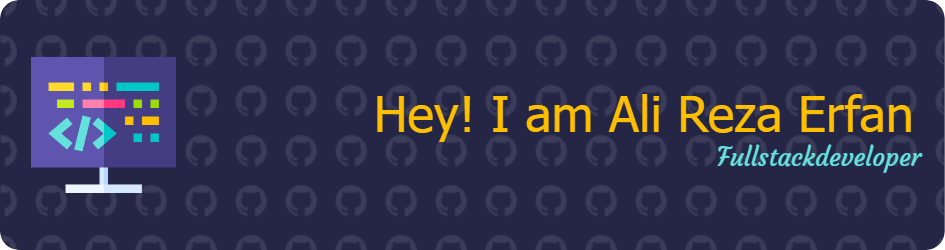

 

Here are some ideas to get you started:

- 🔭 I’m currently working on my Portfolio
- 🌱 I’m currently learning DevOps
- 👯 I’m looking to collaborate on some fun opensource project
- 💬 Ask me about coding
--> 

